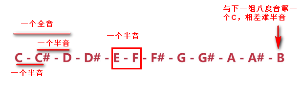

# 音乐曲子

## 一、前提知识
### 1. 乐理知识
#### 1.1 音符:note

c - d - e - f - g - a -b 

do - re - mi - fa - sol - la - si 

1 - 2 - 3 - 4 - 5 - 6 - 7 

#### 1.2 一个八度：octave

升音符号：sharp 半音

#### 1.3 midi音符

                                                                                          
### 1.2 音乐与数学

2/4：以四分音符为一拍，每小节2拍

#### 毕达哥斯拉琴弦律

两个音弦长成简单整数闭，同时或连续弹奏，发出和谐声音。

和谐的比例贯穿整个大自然的“音乐”。

宇宙的星球间的距离成简单整数比，运行时发出美妙的“球体音乐”。

#### 法国数学家傅里叶的证明
所有的乐声（不论是器乐还是声乐）都能用数学表达式来描述

是一些简单的正弦周期函数的和

每种声音都有三种品质：音调、音量和音色。

#### 黄金比例和斐波那契数列

黄金比例：0.618:1

斐波那契数列1，1，2，3，5，8，13，21，34.....

## 项目介绍
###1.采用的音乐格式：

music instrument digital interface(乐器数字接口)

"数码乐谱"。二进制文件。基本结构：文件头+数据描述

现代音乐几乎都是用midi加上音色库来制作合成的。

记录的是音符，控制参数等指令，它指示设备要做什么及怎么做

电脑、合成器、声卡以及电子乐器能互相控制，交换信息

**优势:**
1. 小：midi文件一般十几kb。
2. 记录的信息丰富：音轨，音调，强度，音量，颤音，相位，节奏。
3. 提高制作音乐效率，降低成本。

###2.采用的网络结构：RNN（循环神经网络，序列化）

###3.开发环境
根据操作系统自行安装对应版本。
#### TensorFlow
    pip install tensorflow
#### Keras
    pip install keras
#### Music21
    pip install music21
#### H5PY
    pip install h5py
#### Ffmpeg
    apt install ffmpeg
#### Timidity
    apt install timidity
    

